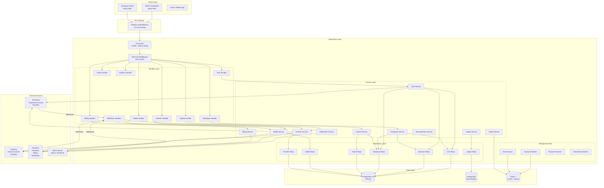
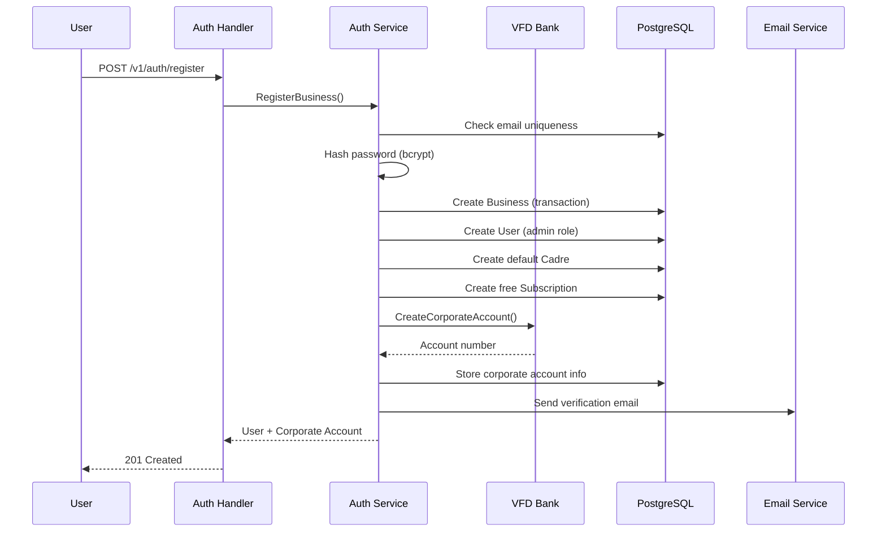
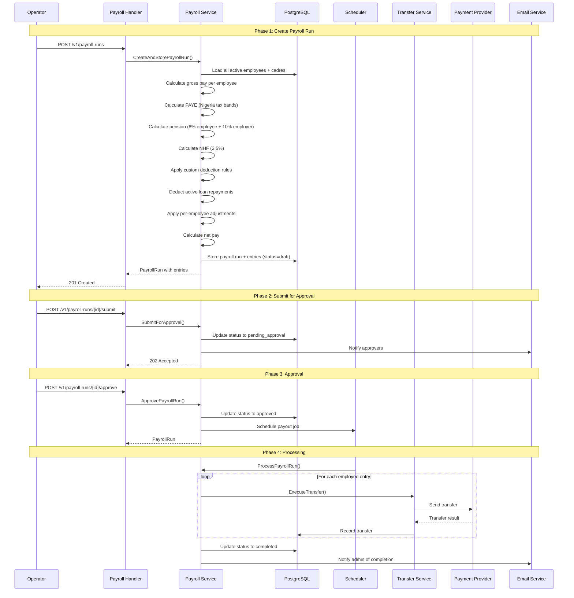
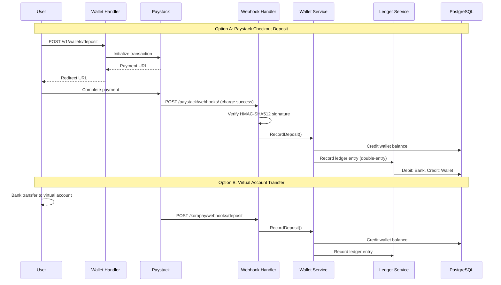

# PayFlow Architecture

## System Architecture



---

## Clean Architecture Layers

PayFlow follows a clean (hexagonal) architecture with four distinct layers:

```
Handler Layer (HTTP)  -->  Service Layer (Business Logic)  -->  Repository Layer (Data Access)
       |                           |                                     |
  Request DTOs              Domain Models                         PostgreSQL
  Response DTOs             Domain Errors                         (via GORM)
  Validation                Interfaces
```

### Layer Responsibilities

| Layer | Package | Responsibility |
|-------|---------|---------------|
| **Handler** | `internal/api/handler/` | HTTP request/response handling, input validation, auth extraction |
| **Service** | `internal/service/` | Business logic, orchestration, domain rules |
| **Repository** | `internal/repository/postgres/` | Database queries, GORM operations |
| **Domain** | `internal/domain/` | Models, interfaces, errors, constants |
| **Platform** | `internal/platform/` | External service clients (Korapay, Paystack, VFD, SMTP) |

### Dependency Direction

Dependencies flow inward: handlers depend on services, services depend on repositories and domain interfaces, repositories depend on domain models. External services are abstracted behind interfaces defined in `domain/`.

---

## Data Flow Diagrams

### Business Registration



### Payroll Lifecycle



### Wallet Deposit Flow



---

## Background Jobs

| Job | Schedule | Description |
|-----|----------|-------------|
| **Payroll Payout Processing** | On-demand (after approval) | Processes approved payroll runs by executing transfers for each employee. Uses Asynq if Redis available, gocron otherwise. |
| **Email Delivery** | Async (queue) | Emails are queued via Asynq for reliable delivery with automatic retry. Falls back to synchronous sending if Redis unavailable. |
| **Daily Reconciliation** | Every 24 hours | Verifies wallet balances match ledger totals. Alerts admin on discrepancy. Starts 1 minute after server boot. |
| **Weekly Provider Reconciliation** | Every 7 days | Cross-checks internal transfer records with payment provider APIs. Identifies stuck/orphaned transactions. Starts 5 minutes after boot. |

---

## Security Model

### Authentication
- **JWT Bearer tokens** with configurable expiration (default 72 hours).
- Passwords hashed with **bcrypt**.
- Tokens contain: `user_id`, `business_id`, `role`, `exp`.

### Authorization (RBAC)
| Role | Scope |
|------|-------|
| `super_admin` | Platform-wide: all organizations, platform settings, reconciliation |
| `admin` | Business-wide: all features for their organization |
| `operator` | Employees, payroll creation/submission, transfers, loans |
| `approver` | View payroll, approve/reject payroll runs |
| `employee` | Self-service: profile, payslips, leave requests |

### Multi-Tenancy
- Every query is scoped by `business_id` extracted from the JWT.
- Repository methods enforce tenant isolation at the query level.
- No cross-tenant data access is possible through the API.

### Rate Limiting
- Global: 100 req/sec per IP.
- Auth endpoints: 5 req/sec per IP (brute force protection).
- Transfer creation: 10/hour, 50/day per business (velocity limiting).
- Batch transfers: 5/hour, 20/day per business.

### Encryption
- Platform settings (API keys, secrets) encrypted at rest with **AES-256-GCM**.
- Encryption key derived from first 32 bytes of `JWT_SECRET`.
- Org-level provider key overrides also encrypted.

### Webhook Verification
- Paystack: HMAC-SHA512 signature verification using `x-paystack-signature` header.
- VFD: Webhook secret verification.
- KoraPay: Signature verification via KoraPay client.

---

## Database Schema Overview

Current migration version: **000027**.

### Core Tables

| Table | Description |
|-------|-------------|
| `businesses` | Tenant organizations with statutory settings and payroll config |
| `users` | Admin, operator, approver, employee accounts with bcrypt passwords |
| `user_tokens` | Password reset tokens, invitation tokens, email verification tokens |
| `employees` | Employee records with bank details, cadre assignment, tax IDs |
| `cadres` | Salary structures with JSON earning components |
| `deduction_rules` | Custom deduction rules (percentage or flat, based on gross or basic) |

### Payroll Tables

| Table | Description |
|-------|-------------|
| `payroll_runs` | Payroll run header: period, status, totals, processing metadata |
| `payroll_run_entries` | Per-employee payroll breakdown: gross, PAYE, pension, NHF, net |
| `payroll_entry_details` | Line-item details for each entry (earning components, deductions) |

### Financial Tables

| Table | Description |
|-------|-------------|
| `wallets` | Business wallet with balance and virtual account details |
| `wallet_transactions` | Wallet transaction log (deposits, withdrawals) |
| `transfers` | Provider-agnostic transfer records |
| `vfd_transfers` | Legacy VFD-specific transfer records |
| `ledger_entries` | Double-entry accounting ledger |
| `employee_loans` | Loan records with monthly deduction tracking |

### Platform Tables

| Table | Description |
|-------|-------------|
| `subscription_plans` | Billing plan definitions (Free, Growth, Enterprise) |
| `subscriptions` | Business subscription state |
| `invoices` | Billing invoice records |
| `platform_settings` | Encrypted platform-wide settings |
| `org_provider_settings` | Encrypted org-level provider key overrides |

### Supporting Tables

| Table | Description |
|-------|-------------|
| `audit_logs` | Audit trail for admin actions |
| `notifications` | In-app notification records |
| `vfd_webhook_notifications` | VFD webhook payload archive |
| `leave_types` | Leave type definitions per business |
| `leave_requests` | Employee leave requests with approval status |
| `leave_balances` | Leave balance tracking per employee per year |

---

## Caching Strategy

PayFlow uses Redis as an optional cache layer. All caching is nil-safe -- if Redis is unavailable, operations fall through to the database.

### Cached Data

| Data | TTL | Invalidation |
|------|-----|-------------|
| Cadre list (per business) | Until mutation | Invalidated on create/update/delete |
| Deduction rules (per business) | Until mutation | Invalidated on create/update/delete |
| Wallet balance | Short-lived | Invalidated on deposit/withdrawal |

### Cache Pattern

```
Read: Cache -> DB (cache-aside / lazy loading)
Write: DB first -> Invalidate cache
```

The cache service is injected into services that benefit from caching. Services that do not benefit (payroll runs, transfers) always read from the database.
